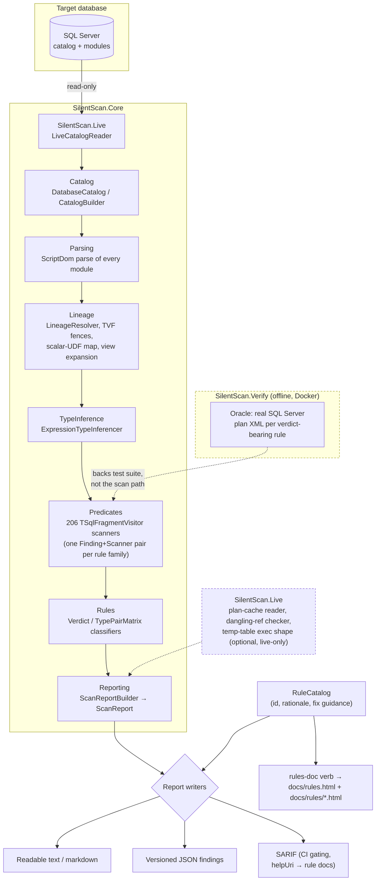

# SilentScan

Static analyzer for SQL Server / T-SQL. It reads your code and your
database's real catalog — no execution plan needed — and finds the bugs that
compile, run, return the right rows on test data, and are still wrong.

**274 rules across 11 families** — implicit conversions that silently kill an
index seek, DML that truncates or rounds data with no engine error, unsafe
dynamic SQL, missing indexes, dangerous triggers, and more. Every rule that
makes a plan-shape or runtime claim is verified against a real SQL Server
instance before it ships, never guessed from documentation.

See **[the full rule catalog](https://umangbhatt.in/mssql-silentscan/rules.html)**
for what each rule finds, why it matters, and how to fix it.

## Why

If a defect is provable from the code and schema, it's in scope. If it only
shows up once the app is running in production, it's out — this is a static
analyzer, not an APM. That's what lets it run before the commit, against a
disposable dev copy, instead of waiting for the production workload to expose
the bug.

Precision beats recall throughout: one false positive is worse than ten
missed true positives. Uncertain inference is reported as `Unknown`, never
guessed.

## Requirements

* .NET 10 SDK
* Docker (for the verification oracle and benchmarks)

## Build & test

```
scripts/dotnet-safe.sh build
scripts/dotnet-safe.sh test
```

Always go through `dotnet-safe.sh`, not `dotnet` directly — it works around a
known VBCSCompiler race that plain `dotnet build`/`test` can hit under
repeated invocations.

## Scan a live database

```
dotnet run --project src/SilentScan.Cli -- scan-db <connection-string> \
  [--format text|markdown|json|sarif] [--confidence high|medium|low] [--output <file>]
```

Connects to a live SQL Server database, reads its catalog straight from
engine metadata, and runs every readable view, procedure, function and
trigger through all 274 rules in one read-only pass — no DDL or DML is ever
executed against the database you point it at.

* `--format text` (default) — a readable report, grouped and explained.
* `--format json` — the full versioned findings schema, for another tool or an AI assistant.
* `--format sarif` — for CI gating; each rule's `helpUri` links to its own page in the rule catalog.

It's built for the AI-assisted coding loop as much as for humans: nothing is
uploaded anywhere, the scan is read-only, and every finding is machine-
readable enough for an assistant to fix the SQL and re-scan to confirm the
finding is gone.

## Verification oracle (Docker SQL Server)

```
cp .env.example .env      # override SILENTSCAN_SA_PASSWORD if you want
docker compose up -d
```

Connects on `localhost,14330`, user `sa`. Backs the test suite and the
verification/benchmark tooling — every verdict-bearing rule is checked
against this instance's real plan XML before it ships.

## Layout

* `src/SilentScan.Core` — parsing, catalog, lineage, predicates/rules,
  reporting.
* `src/SilentScan.Live` — the live, engine-authoritative catalog reader and
  live-only scanners.
* `src/SilentScan.Cli` — `scan-db` / `rules-doc`.
* `src/SilentScan.Verify` — the Docker-backed verification oracle.
* `src/SilentScan.Bench` — benchmark harness.
* `tests/SilentScan.Tests` — xUnit tests and fixtures.

## Architecture

`scan-db` is the only entry point that matters at runtime: connect, read,
scan, report. Nothing is ever written back to the target database.



**Pipeline, in order:** `LiveCatalogReader` reads catalog metadata and module
text straight from engine catalog views (`sys.*`), never executing app DDL/DML.
`CatalogBuilder` folds in anything only visible by parsing (e.g. `SELECT
INTO` shapes). Every module is parsed once via ScriptDom
(`SqlScriptParser`); `LineageResolver` resolves column provenance across
CTEs, views, and multi-statement TVFs; `ExpressionTypeInferencer` assigns a
`SqlType` to every scalar expression. The 206 predicate scanners in
`Core/Predicates` each walk the AST (many now sharing the same proc/trigger
scope walker) and emit typed findings, classified against oracle-verified
truth tables in `Core/Rules` (implicit-conversion matrix, write-loss,
sargability, temporal-boundary, TVF-fence, scalar-UDF). `ScanReportBuilder`
assembles everything into one `ScanReport`, which the `Reporting` writers
render as text, JSON, or SARIF — all keyed against the single
`RuleCatalog` source of truth that also generates the published rule docs.

`SilentScan.Verify` never runs during a scan — it's the offline oracle
(Dockerized SQL Server) that every verdict-bearing rule's truth table is
checked against before it ships, and it backs the test suite.

## More detail

* [Rule catalog](https://umangbhatt.in/mssql-silentscan/rules.html) — every
  rule, its rationale, and how to fix it.
* `CLAUDE.md` — the full project contract: scope, detection streams,
  verification approach.
* `docs/detection-tasklist.md` — the working backlog.
* `docs/local-dev.md` — further local setup detail.
